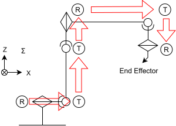

v# Manipulator Kinematics

This project implements computational modules for both forward and inverse kinematics of a 6-degree-of-freedom (6-DoF) robot.
The implementation is in C#.

## Status

There is one forward kinematics function and two inverse kinematics (IK) functions are in "KLib" project, a core of this repository.  
KLib's forward kinematics and part of inverse (Jacobian) kinematics are working but IK function derived using a geometric approach is still under development.

## Target robot type

This code includes a sample robot: a 6DoF manipulator with joints arranged as Round-Turn-Turn-Round-Turn-Round (RTTRTR). In its initial posture, all link positions have a Y-coordinate of zero. Each joint is rotational, and the joint angle $\theta_i$ serves as the control parameter for the robot's configuration. There are no prismatic (linear) joints. If you're not familiar with designations like "RTTRTR", please refer to the following Fig-1.

    
    
Fig-1. definition of RTTRTR manipulator

 
'R' refers to a joint where the central axis of the preceding link and the axis of rotation coincide, while 'T' refers to a joint where the central axis of the preceding link and the axis of rotation are orthogonal. From the base to the tip of the robot, these 'R' and 'T' joints are connected in sequence and denoted by combinations such as "RTTRTR".  

Of course, you can define another type in the code.

## Coodinate system representation

Since the system operates in three-dimensional space, transformation equations are primarily structured as products of $4\times4$ matrices. All coordinate systems use a right-handed convention. The sign of rotational angles follows the right-hand rule: when viewed from a positive position along the axis toward the origin, counterclockwise (CCW) rotation is considered positive.  

The space where the robot is installed is called the absolute coordinate system. In the initial posture—where all joint angles $\theta_i$ are zero—the orientation of the absolute coordinate axes is as follows: the forward direction from the robot base corresponds to the positive $X_0$ axis, represented by the vector (1, 0, 0); the upward direction aligns with the $Z_0$ axis, represented by (0, 0, 1); and, due to the right-handed convention, the positive $Y_0$ axis points to the robot's left, represented by (0, 1, 0). For now, the robot is assumed to be positioned at the origin of the absolute coordinate system.

Joint and link indices start at 0 for the fixed robot base and increment sequentially toward the end-effector: 1, 2, ..., n. Coordinates are expressed as (X, Y, Z), with units in millimeters. Values are rounded to three decimal places for precision. Angular measurements are in radians, but when converted to degrees, values are rounded to four decimal places.

The orientation of links and coordinate axes is represented by unit-length vectors. The final stage of the manipulator includes a fixed-orientation end-effector, currently it supports only one tool for one instance. The position and direction of tool tip is defined in the tool-axis local coordinate system as $(Xt, Yt, Zt, vx, vy, vz)$, and managed as an array. The orientation of the coordinate system in which the end-effector is mounted matches that of the 6-axis local frame. The parameters $vx, vy, vz$ represent vector on the end-effector coordinate system $\varSigma_t$. This is not an Euler expression nor rotation angles about Xt, Yt, Zt. The way to handle the vector is decided by implementation.

## Target Specification

### Definition of the Modified Denavit-Hartenberg (MDH) Line Coordinates (Local Convention)

The coordinate origin $O_i$ is placed on the Z-axis of joint $i$. The local coordinate system is denoted by $\varSigma_i$. The transformation matrix from the local coordinate system $\varSigma_{i-1}$ to $\varSigma_i$ is represented as $^{i-1}T_i$.

$$
 \boldsymbol{\varSigma_0 \underset{^0T_1}{\Longrightarrow} \varSigma_1 \underset{^1T_2}{\Longrightarrow} \varSigma_2 \underset{^2T_3}{\Longrightarrow} ... \underset{^{n-1}T_n}{\Longrightarrow} \varSigma_n \underset{^{n}T_t}{\Longrightarrow} \varSigma_t }
$$

Here, $n = 6$, and ${}^{n}T_t$ represents the transform from the robot’s axis coordinate system to the tool (end-effector) tip coordinate system. For now, the absolute coordinate $\varSigma$ is the same as $\varSigma_0$. $\varSigma_0$ is a fixed (not rotate) base coordinate where the manipulator is installed.  
All $Z_i$ are defined as the axis of rotation (though $Z_0$ does not have rotate joint). 

The coordinate transformation at each robot axis is given by:

$$
\boldsymbol{{}^{i-1}T_i = RotX(x_{i-1}, \alpha_{i-1}) \rightarrow TransX(x_{i-1}, a_{i-1}) \rightarrow RotZ(z_i, \theta_i) \rightarrow TransZ(z_i, d_i)}
$$

*Please note the distinction between $a$ and $\alpha$. The usage of these symbols follows conventional practice.  
*The order of this matrix multiplication formula may vary in code. When applying matrices to a vector, the order is $RotX, TransX, RotZ, TransZ$, so the formula is $newVector = TransZ \times RotZ \times TransX \times RotX \times Vector$. Depending on the library or struct definition (column-major or row-major), additional matrix operations may be needed. The "$\rightarrow$" indicates the order of translation, not matrix multiplication "$\times$". The strict transformation sequence is as follows.

The ${}^{i-1}T_i$ transformation is performed in the following sequence:

1. Rotate by $\alpha_{i-1}$ around the $x_{i-1}$ axis  
2. Translate by $a_{i-1}$ along the $x_{i-1}$ axis  
3. Rotate by $\theta_i$ around the $z_i$ axis  
4. Translate by $d_i$ along the $z_i$ axis  

The expression can be abbreviated as follows:

$$
\boldsymbol{{}^{i-1}T_i = RotX_{i-1} \rightarrow TransX_{i-1} \rightarrow RotZ_i \rightarrow TransZ_i}
$$

The orientation of the robot base coordinate system is aligned with the absolute coordinate axes as described above, and the robot base is assumed to be placed at the origin of the absolute coordinate system.

$\overrightarrow{Z_0} = (0,0,1)$  
$\overrightarrow{X_0} = (1,0,0)$  

In the following table, $\overrightarrow{Z_i}$ and $\overrightarrow{X_i}$ denote the directions of the Z-axis and X-axis of the local coordinate system $\varSigma_i$, respectively. Though these vectors are not part of MDH, they are expressed in the absolute coordinate frame for confirmation, under the condition that all joint input angles $\theta_i$ are set to zero.

|L|$\alpha_{i-1}$|$a_{i-1}$|$offset+\theta_i$|$d_i$|$\overrightarrow{Z_i}$|$\overrightarrow{X_i}$|
|---|---:|---:|---:|---:|---|---|
|1|0|0|$\theta_1$|127|(0,0,1)|(1,0,0)|
|2|$\frac{\pi}{2}$|29.69|$\frac{\pi}{2} + \theta_2$|0|(0,-1,0)|(0,0,1)|
|3|$\pi$|108|$\theta_3$|0|(0,1,0)|(0,0,1)|
|4|$-\frac{\pi}{2}$|20|$\theta_4$|168.98|(1,0,0)|(0,0,1)|
|5|$\frac{\pi}{2}$|0|$-\frac{\pi}{2}+\theta_5$|0|(0,1,0)|(1,0,0)|
|6|$\frac{\pi}{2}$|0|$\theta_6$|24.29|(0,0,-1)|(1,0,0)|

where,  
a: link length (length of the common normal line)  
α: twisted (link) angle  
θ: rotation around the local Z axis (joint angle), with possible offset values defined separately.  
d: link offset (distance between the feet of the two common perpendiculars on the joint)  

*These parameters comes from WLKATA MiRobot, an RTTRTR 6DoF mini manipulator but directions of each local axis are NOT according to it.

The initial posture of the robot is defined below. (Lengths are not to scale.)

    
    
Fig-1. local coodinate system of target manipulator (not include end-effector)

 

--- Design of Frame Origins ($^0T_t$) ---  
|frame|position on absolute space|Local axis verctor on absolute space|
|---|---|---|
|O0 (Fixed base)|(0, 0, 0)|fixed axis, just defines location and direction of the robot base. X0:(1,0,0), Y0:(0,1,0), Z0:(0,0,1)|
|O1 (Joint 1 origin)|(0.000, 0, 127.000)|X1:(1,0,0), Y1:(0,1,0), Z1:(0,0,1)|
|O2 (Joint 2 origin)|(29.690, 0, 127.000)|X2:(0,0,1), Y2:(-1,0,0), Z2:(0,-1,0)|
|O3 (Joint 3 origin)|(29.690, 0, 127+108)|X3:(0,0,1), Y3:(1,0,0), Z3:(0,1,0)|
|O4 (Joint 4 origin)|(29.690+168.98, 0, 127+108+20)|X4:(0,0,1), Y4:(0,-1,0), Z4:(1,0,0)|
|O5 (Joint 5 origin)|(29.690+168.98, 0, 127+108+20)|X5:(-1,0,0), Y5:(0,0,1), Z5:(0,1,0)|
|O6 (Joint 6 origin)|(29.690+168.98, 0, 127+108+20-24.29)|X6:(-1,0,0), Y6:(0,1,0), Z6:(0,0,-1)|
|Ot (TCP)|(depends on "TCP position and vector" given at instance of robot.)|O6 is as same as origin and direction of tool axis. Zt is the direction of TCP.|

"initial posture" means all joint angles $\theta_i = 0$ and equips tool with $(Xt, Yt, Zt, vx, vy, vz) = (0,0,0,0,0,1)$, which is the "TCP position and vector".  
Strictly speaking, the TCP (Tool Center Point) is not the same as the "tool tip." The TCP is a control reference point, whereas the tool tip refers to a physical position. However, in this context, I treat them as identical.

### Forward Kinematics (FK)
The MDH is sufficient for Forward Kinematics. The transformation from the absolute coordinate system to the TCP coordinate system are defined completely with the MDH. Remember, this FK includes the TCP position and direction.

### Inverse Kinematics (IK)
The crank angle between $O_3$ and $O_4$ is the issue for Inverse Kinematics. The fixed crank angle is called "elbow". The crank might be able to remove defining the 4th link is $\overrightarrow{O_3O_4}$ and angle of $\theta_3$ and $\theta_5$ has some offset according to the angles of $O_3-elbow-O_4$. But, in real world, those offset are not revealed at teaching pendant. Then I want to remove such offset from MDH.

#### Jacobian approach (working)
#### Giometric approach (under development)
#### Algebraic approach (not yet)