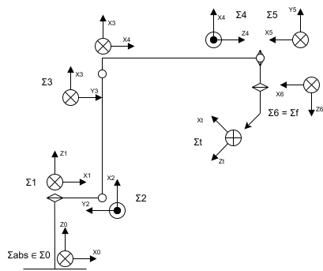

# 6DoF Manipulator Kinematics with a virtual fixed joint

This project implements computational modules for both forward and inverse kinematics of a 6-degree-of-freedom (6-DoF) robot.  
The implementation is in C#.

## Status

There is one forward kinematics function and two inverse kinematics (IK) functions are in "KLib" project, a core of this repository.  
Though I still struggling to make adequate prompt, the current "free plan"s are difficult to complete these functions.
Looking `Forward()`, it almost be completed, with optional pointing, but IK is miserable.  
- GPT4.1 on GitHub: cannot read pdf but read markdown with TeX formulas. It does not understand MDH. MDH has several convention then I define it cleary as my local convention but it repeat changing only the order of  multiplication of RotX, TransX, RotZ, TransZ. It should not be used for code generation. It show some patches at VisualStudio, sometimes they erase rest of dictation. It tries to force the knowledge it already has into an answer to my question, and ends up giving an incorrect response.   
- Gemini flash 2.5: it can solve Inverse Jacobian but not Inverse Geometric. The output cord is partial (default).
- Gemini-CLI: Great code self simulation tool even it is performance issue, it makes modules and compare performance. But the quality is as same as Gemini pro 2.5. For poor programmer like me, most recommended.  
- Gemini pro 2.5: Ah... I've run out of this month's limit.  

## Motivation

Ah...AI, trasformer, LLM, Generative Pre-trained Transformer, or Copilot and Gemini, sometimes Chat-GPT (almost free plan).  
I've ever made script to solve Forward and Inverse kinematics of a 6DoF real manipulators. Almost of all have a special link that has 90 degree fixed crank. The crank lays between O3 and O4, the origins of local coodinate on robot joints. They were a little bit dirty code especialy solve with geometric approach.  
Recently, I thought "Why don't I try to make it clean using generative AI?". The date I've started this project a few days ago, Oct. 5th, 2025. I've spent about a week to get the first working modules.  
Though I've felt I should wait one or two years until AI becomes more powerful, I was too impatient. So I started this project.

## Target robot type

This code includes a sample robot: a 6DoF manipulator with joints arranged as Round-Turn-Turn-Round-Turn-Round (RTTRTR). In its initial posture, all link positions have a Y-coordinate of zero. Each joint is rotational, and the joint angle $\theta_i$ serves as the control parameter for the robot's configuration. There are no real prismatic (linear) joints. If you're not familiar with designations like "RTTRTR", please refer to the following Fig-1.

    
    
Fig-1. definition of RTTRTR manipulator

 
'R' refers to a joint where the central axis of the preceding link and the axis of rotation coincide, while 'T' refers to a joint where the central axis of the preceding link and the axis of rotation are orthogonal. From the base to the tip of the robot, these 'R' and 'T' joints are connected in sequence and denoted by combinations such as "RTTRTR".  

Of course, you can add another type in the code but I'm not resposible for it.

## Coordinate system representation

Since the system operates in three-dimensional space, transformation equations are primarily structured as products of $4\times4$ Homogeneous transformation matrices. All coordinate systems are Cartesian and use a right-handed convention. The sign of rotational angles follows the right-hand rule: when viewed from a positive position along the axis toward the origin, counterclockwise (CCW) rotation is considered positive.  

The space where the robot is installed is called the absolute (or world) coordinate system $\varSigma_0$. It's axis are represented as $(X_0, Y_0, Z_0)$. In the "initial" posture—where all joint angles $\theta_i$ are zero, the orientation of the absolute coordinate axes is as follows: the forward direction from the robot base corresponds to the positive $X_0$ axis, represented by the vector (1, 0, 0); the upward direction aligns with the $Z_0$ axis, represented by (0, 0, 1); and, due to the right-handed convention, the positive $Y_0$ axis points to the robot's left, represented by (0, 1, 0). For now, the robot is assumed to be positioned at the origin of the absolute coordinate system.

Joint and link indices start at 0 for the fixed robot base and increment sequentially toward the end-effector: 1, 2, ..., n. Coordinates are expressed with it's origin $O_i$ position and axes $(X, Y, Z)$ in verctor on $\varSigma_{abs}$, with units in millimeters. Values are rounded to three decimal places for precision. Angular measurements are in radians, but when converted to degrees, values are rounded to four decimal places.

The orientation of links and coordinate axes is represented by unit-length vectors.

### Tool coordinate system

The final stage of the manipulator includes a fixed-orientation end-effector, and currently, only one tool is supported per instance. The position and orientation of the tool tip are defined in the local coordinate system $\varSigma_6$ (i.e., the flange coordinate system) as $(Xt, Yt, Zt, rx, ry, rz)$, and provided as an array of six double-precision elements. The position of the TCP (Tool Center Point), which serves as the control point of the end-effector, is given by $(Xt, Yt, Zt)$, and its orientation is specified by $(rx, ry, rz)$. This orientation indicates how the coordinate system $\varSigma_t$, placed at the TCP position, must be rotated around each axis of $\varSigma_6$ in order to align with $\varSigma_t$ (the origin remains at $(Xt, Yt, Zt)$). The order of applying these rotations is $rz \rightarrow ry \rightarrow rx$. Then this defines a tool coordinate system ($\varSigma_t$) at TCP including direction of each axis. Naturally, the $Z_t$ is the direction of the tool point at.
The way to define these tools, it is NOT an Euler angle representation. It is the so-called Yaskawa convention.

### World coordinate ssytem (again)

The absolute coordinate system $\varSigma_0$ is also referred to as the world coordinate system $\varSigma_{abs}$. As default, the robot base is assumed to be located at the origin point (0, 0, 0). The orientation of the axes in this system is defined such that the positive $X_0$ axis points forward from the robot base, the positive $Z_0$ axis points upward, and the positive $Y_0$ axis points to the left side of the robot when viewed from above. This right-handed coordinate system serves as the reference frame for all transformations and calculations related to the robot's kinematics. The mounting paramters are like tool coordinate system, $(X_0, Y_0, Z_0, rx_0, ry_0, rz_0)$. Then in the default, $\verSigma_0$ is as same as the $\verSigma_1$.

## Target Specification

### Definition of the Modified Denavit-Hartenberg (MDH) Line Coordinates (Local Convention)

The coordinate origin $O_i$ is placed on the Z-axis of joint $i$. The local coordinate system is denoted by $\varSigma_i$. The transformation matrix from the local coordinate system $\varSigma_{i-1}$ to $\varSigma_i$ is represented as $^{i-1}T_i$.

$$
 \boldsymbol{\varSigma_0 \underset{^0T_1}{\Longrightarrow} \varSigma_1 \underset{^1T_2}{\Longrightarrow} \varSigma_2 \underset{^2T_3}{\Longrightarrow} \varSigma_3 \underset{^3T_e}{\Longrightarrow} \varSigma_e \underset{^eT_4}{\Longrightarrow} \varSigma_4 \underset{^4T_5}{\Longrightarrow} \varSigma_5 \underset{^5T_6}{\Longrightarrow} \varSigma_6 \underset{^6T_{t}}{\Longrightarrow} \varSigma_{t} }
$$
 
Here, $^{6}T_{t}$ represents the transformation from the robot’s axis coordinate system to the tool (end-effector) tip coordinate system. The coordinate system $\varSigma_6$ is regarded as equivalent to the so-called flange coordinate system. The $\varSigma_0$ is the absolute coordinate system. Then the Homogeneous transformation matrices for $^{0}T_{1}$, $^{3}T_{e}$ and $^{6}T_{t}$ are fixed matrices.  
*Strictly speaking, the TCP (Tool Center Point) is not same as the "tool tip". The TCP is a control reference point, whereas the tool tip refers to a physical position. However, in this context, I treat them as identical.

All $Z_i$ are defined as the axis of rotation (though $Z_0$ does not have rotate joint). 

The coordinate transformation at each robot axis is given by:

$$
\boldsymbol{^{i-1}T_i = RotX(x_{i-1}, \alpha_{i-1}) \rightarrow TransX(x_{i-1}, a_{i-1}) \rightarrow RotZ(z_i, \theta_i) \rightarrow TransZ(z_i, d_i)}
$$

*Please note the distinction between $a$ and $\alpha$. The usage of these symbols follows conventional practice.  
*The order of this matrix multiplication formula may vary in code. When applying matrices to a vector, the order is $RotX, TransX, RotZ, TransZ$, so the formula is $newVector = TransZ \times RotZ \times TransX \times RotX \times Vector$ (if row-major?). Depending on the library or struct definition (column-major or row-major), additional or reversed matrix operations may be needed. Geometically, the $"\rightarrow"$ indicates the order of translation, not matrix multiplication $"\times"$. The strict transformation sequence is as follows.

The $^{i-1}T_i$ transformation is performed in the following sequence:

1. Rotate by $\alpha_{i-1}$ around the $x_{i-1}$ axis  
2. Translate by $a_{i-1}$ along the $x_{i-1}$ axis  
3. Rotate by $\theta_i$ around the $z_i$ axis  
4. Translate by $d_i$ along the $z_i$ axis  

The orientation of the robot base coordinate system is aligned with the absolute coordinate axes as described above, and the robot base is assumed to be placed at the origin of the absolute coordinate system.

$\overrightarrow{Z_0} = (0,0,1)$  
$\overrightarrow{X_0} = (1,0,0)$  

In the following table, $\overrightarrow{Z_i}$ and $\overrightarrow{X_i}$ denote the directions of the Z-axis and X-axis of the local coordinate system $\varSigma_i$, respectively. Though these vectors are not part of MDH, they are expressed in the $\varSigma_0$, now which is as same as absolute frame $\varSigma_{abs}$ for confirmation, under the condition that all joint input angles $\theta_i$ are set to zero.

|L|$\alpha_{i-1}$|$a_{i-1}$|$offset+\theta_i$|$d_i$|$\overrightarrow{Z_i}$|$\overrightarrow{X_i}$|
|---|---:|---:|---:|---:|---|---|
|0|-|0|0|0|(0,0,1)|(1,0,0)|
|1|0|0|$\theta_1$|127|(0,0,1)|(1,0,0)|
|2|$\frac{\pi}{2}$|29.69|$\frac{\pi}{2} + \theta_2$|0|(0,-1,0)|(0,0,1)|
|3|0|108|$-\frac{\pi}{2}+\theta_3$|0|(0,-1,0)|(1,0,0)|
|e|$\frac{\pi}{2}$|0|0|-20|(0,0,-1)|(1,0,0)|
|4|$-\frac{\pi}{2}$|168.98|$-\pi+\theta_4$|0|(0,-1,0)|(-1,0,0)|
|5|$-\frac{\pi}{2}$|0|$\theta_5$|0|(0,0,-1)|(-1,0,0)|
|6|0|0|$\theta_6$|24.29|(0,0,-1)|(-1,0,0)|

where,  
$a$: link length (length of the common normal line)  
$α$: twisted (link) angle  
$\theta$: rotation around the local Z axis (joint angle), with possible offset values defined separately.  
$d$: link offset (distance between the feet of the two common perpendiculars on the joint)  

*These parameters comes from WLKATA MiRobot, an RTTRTR 6DoF mini manipulator but directions of each local axis are NOT according to it.
*The column of $\overrightarrow{Z_i}$ and $\overrightarrow{X_i}$ are not part of MDH. Just for reference.

There may be some MDHs for same pysical manipulator. At first, I've tried one without the virtul prismatic joint. The MDH can describe the manipulator completely. No error as far as it is FK. But for IK, generating geometrical solver was miserable. Iterating to generate partial patch (but it dowsn't work) forever. With the virtul prismatic joint, still, geometrical approach was difficult but just a few manually leading, it seems start working.
If you're robot builder, choose one for adequate motor control and weight balance.

The initial posture of the robot is defined below. (Lengths are not to scale.)

    
    
Fig-1. local coodinate system of target manipulator

 

In this diagram, the Tool is represented something like $(u \times \frac{1}{\sqrt{2}}, 0.0, u \times (1 + \frac{1}{\sqrt{2}}), 0, 45, 0)$. 
There need nine matrices for FK but three of them are fixed. Then IK should be solved.

--- Design of Frame Origins ($^0T_{t}$) ---  
|frame|position on absolute space|Local axis verctor on absolute space|
|---|---|---|
|$O_0$ (Fixed base)|(0, 0, 0)|fixed axis, just defines location and direction of the robot base. X0:(1,0,0), Y0:(0,1,0), Z0:(0,0,1) This is as same as absolute (world) axis, assumed.|
|$O_1$ (Joint 1 origin)|(0.000, 0, 127.000)|X1:(1,0,0), Y1:(0,1,0), Z1:(0,0,1)|
|$O_2$ (Joint 2 origin)|(29.690, 0, 127.000)|X2:(0,0,1), Y2:(-1,0,0), Z2:(0,-1,0)|
|$O_3$ (Joint 3 origin)|(29.690, 0, 127+108)|X3:(1,0,0), Y3:(0,0,1), Z3:(0,-1,0)|
|$O_e$ (fixed joint)|(29.690, 0, 127+108+20)|Xe:(1,0,0), Y:(0,-1,0), Z:((0,0,-1))|
|$O_4$ (Joint 4 origin)|(29.690+168.98, 0, 127+108+20)|X4:(-1,0,0), Y4:(0,0,-1), Z4:(0,-1,0)|
|$O_5$ (Joint 5 origin)|(29.690+168.98, 0, 127+108+20)|X5:(-1,0,0), Y5:(0,1,0), Z5:(0,0,-1)|
|$O_6$ (Joint 6 origin), $O_t$|(29.690+168.98, 0, 127+108+20-24.29)|X6:(-1,0,0), Y6:(0,1,0), Z6:(0,0,-1) This is as same as flange coordinate system, $(X_f, Y_f, Z_f)$.|
|$O_{t}$ (TCP)|(depends on "TCP position and TCP rotation" given at instance of robot.)|$Z_{t}$ is assumed as the direction of TCP.|

"initial posture" means all joint angles $\theta_i = 0$ and equips "null" tool, $(Xt, Yt, Zt, rx, ry, rz) = (0,0,0,0,0,0)$, which is the "TCP position and rotation" on $\varSigma_6$.  

Please note: this is the first plan for this robot. Same size robot can be described with several MDH. So I'll modify this afterwards.

### Forward Kinematics (FK)

The FK is easy enough with the MDH. The transformation from the absolute coordinate system to the TCP coordinate system are defined completely with the MDH. Remember, this FK includes the TCP position and direction.  
- KLib.KinematicsCM.Forward() : based on column major matrix operation
- KLib.KinematicsRM.Forward() : based on row major matrix operation

### Inverse Kinematics (IK)

Once I've solved IK by hand. This time is "AI trial". It seems difficult for them especially geometric approach. They know what is MDH but there seems special leading to get correct program, for now.  

The 90 degree crank between $O_3$ and $O_4$ is the issue for IK. The fixed crank angle is called "elbow" that oftenly used real industrial manipulators. The crank might be able to remove defining the 4th link is $\overrightarrow{O_3O_4}$ and add some offset angles to $\theta_3$ and $\theta_5$ according to the triangle of $O_3-elbow-O_4$. But, in real world, those offset are not revealed at teaching pendant nor on any robot control languages. Then I wanted to remove such offset.

#### Jacobian approach (confirming)

- KLib.KinematicsRM.InverseJacobian() : based on row major matrix operation
*The column-major variant of the function is planned to be deprecated.

#### Geometric approach (confirming)

- KLib.KinematicsRM.InverseGeometric() : based on row major matrix operation
*The column-major variant of the function is planned to be deprecated.

#### About result of geometric IK

The most interesting point in KLib might be result of geometical IK. It output several groups of $\theta_i$ to one tool point and direction. I realized it include a flipped tool at $O_6$, means $\theta_6 = A$ and $A + \frac{\pi}{2}$. Apparently it is wrong. This is not "Flipped" nor "elbow up/down". There might be another error in combination of some joint angles. Are there any omissions in the definition of tool? No. It comes from "geometical" approach. Algebraically, the order of matrix operations is significant, but geometrically, that order carries no meaning. As a result, the IK function may output a 180-degree flipped configuration as a valid IK result. To remove this, check result of FK-IK-FK round trip and check direction of tool might be sufficient.
Instead of such checking, a couple of flags will be provided that define fixed pose.

### Structure of this repository

- KLib : core library project, include kinematics modules
  - KinematicsRM.cs : kinematics with row-major matrix operation
  - KinematicsCM.cs : kinematics with column-major matrix operation
  - KinematicsRMn.cs : where n is integer. kinematics with row-major matrix operation (developing)
  - KinematicsCMn.cs : where n is integer. kinematics with column-major matrix operation (developing)
- CheckKLib : console application project, for checking KLib functions

All other projects/codes are under development or test codes or just a gabbage.
The application? There is some projects for it, but no plan to use them for the time moment.

## Unnecessary addition

Understanding transformation matrices isn’t hard. But when it comes to a 6-DOF manipulator with a quirky crank mechanism, things don’t really get harder—just more of a hassle. I get the feeling that the parts I find complicated are also somewhat tricky for AIs to solve.
